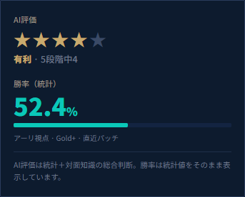
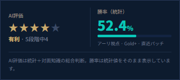
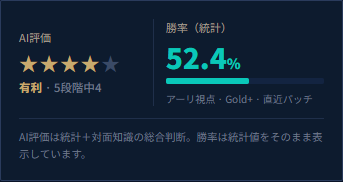
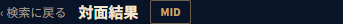
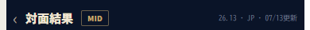
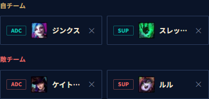
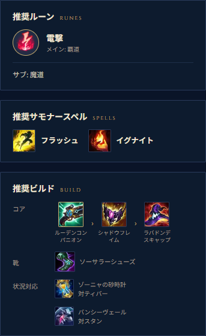
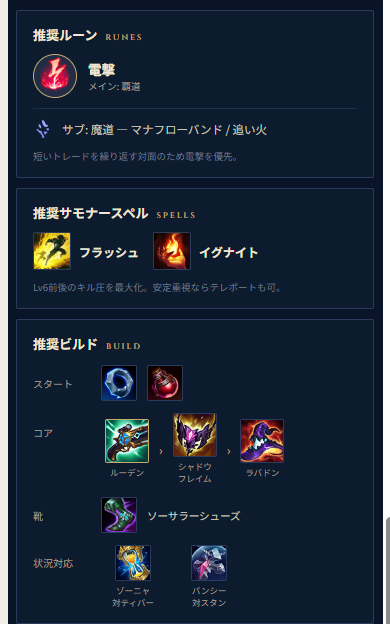

# P5 評価レポート（T-501 / T-502 / T-503）

## 1. 実施概要

| 項目 | 内容 |
|---|---|
| 実施日 | 2026-07-19 |
| ブランチ | `feature/task/P5` |
| コミット | `b5312af` |
| 環境 | Next.js 16.2.10 (Turbopack) / Node v24.11.1 / Windows 11 |
| ビューポート | モバイル 390×844 / PC 1280×800 / 中間幅 1024×800 |
| 手段 | `npm run lint`・`npm run build`・Playwright MCP |
| 照合元 | `docs/design/LoL対面AIアドバイス Metaたろう プロトタイプ.dc.html`（`data-screen-label`） |

**結論**: `docs/08_testing.md` §4 のチェックリストは**全項目パス**。プロトタイプとの視覚差分は §4 に画像付きで列挙した通りで、内訳は**修正済み 1件（D-1）**・**修正候補 1件（D-2）**・**要判断 1件（D-4）**・**差分なし 1件（D-3）**・**スキーマ由来でP5スコープ外 3件（D-5〜D-7）**。ブロッカーはなし。

> D-1 の修正後に `npm run lint` / `npm run build` および該当画面の再評価を実施済み。本レポートの数値・画像は修正後の状態を反映している（D-1 のみ修正前後を併記）。

---

## 2. T-501: 静的検査

| 検査 | 結果 |
|---|---|
| `npm run lint` | ✅ エラー・警告ゼロ（出力なし） |
| `npm run build` | ✅ 成功。TypeScript 通過、21ページ生成 |

対面ページの生成方式（`docs/08_testing.md` §5 の合格基準）:

```
◐ /matchups/[lane]/[slug]   … top×2 / jg×2 / mid×2 = 6件
◐ /matchups/bot/[slug]      … bot×2 = 2件
○ / , /search , /glossary , /robots.txt , /sitemap.xml
```

対面ページ計 **8件すべてが ◐ (Partial Prerender)** として事前生成されており、合格基準「静的（Static / Partial Prerender）と表示されること」を満たす。

### 付随して確認した衛生項目

- `package.json` の `playwright` / `@playwright/mcp` が `dependencies` に入っている。評価専用ツールのため `devDependencies` が適切（本番バンドルには入らないが、`npm ci --omit=dev` での取得対象になる）。→ §5 の要判断項目。

---

## 3. T-502: 受け入れチェックリスト

`docs/08_testing.md` §4 の構成に沿って記載。

### 共通（全画面）

| 項目 | 結果 | 備考 |
|---|---|---|
| ヘッダー（ロゴ・ナビ・Patchバッジ）とフッター（免責表記）が表示される | ✅ | 390pxではナビ・CTAが非表示。プロトタイプ `1a LP` と一致するため仕様通り |
| 配色・フォントが 06_ui §2 のトークンに一致 | ✅ | ネイビー×ゴールド、Noto Sans JP + Cinzel を確認 |
| 390pxで1カラム、1280pxでPCレイアウト | ✅ | 1024pxでも2カラム圧縮を確認。横スクロール発生なし（`scrollWidth` 1009 ≤ 1024） |

### LP（`/`）

| 項目 | 結果 |
|---|---|
| ヒーロー見出し「ロード画面の30秒で、対面がわかる。」とCTA | ✅ |
| 結果プレビューカード・できること3枚・使い方3ステップ | ✅ |
| CTAから `/search` へ遷移 | ✅ |

### 検索（`/search`）

| 項目 | 結果 | 備考 |
|---|---|---|
| 通常レーン / BOT のタブ切替 | ✅ | |
| レーン選択（TOP/JG/MID） | ✅ | 既定 MID |
| 「あに」→ アニー / アニビア（ひらがな） | ✅ | |
| カタカナ「アニ」→ 同じ2件 | ✅ | |
| 英語 `annie` → アニー | ✅ | `lib/search.ts` は部分一致。`annie` は Anivia に含まれないため候補はアニーのみで正しい挙動 |
| 2体確定で実行ボタン活性 → 結果へ遷移 | ✅ | `/matchups/mid/ahri-vs-annie` へ遷移 |
| BOTタブ: 進捗 n/4 表示、4体確定まで実行不可 | ✅ | 3/4時に「残り1体（敵SUP）を選択してください」を確認 |
| BOT 4体確定で結果ページへ遷移 | ✅ | href = `/matchups/bot/jinx-thresh-vs-caitlyn-lulu` |

### 通常レーン結果（`/matchups/mid/ahri-vs-annie`）

| 項目 | 結果 |
|---|---|
| VSパネル・AI評価（星5段階）・勝率（数値+ゲージ） | ✅ |
| 要約 / 詳細立ち回り（序盤・中盤・終盤）/ 注意スキル / パワースパイク / 推奨セット | ✅ |
| 用語リンク・用語チップから `/glossary` の該当アンカーへ遷移 | ✅ |
| `generateMetadata` の title/description と JSON-LD | ✅ |

出力されたメタデータ:

- `title`: `アーリ vs アニー MID対面攻略 | Metaたろう`
- `description` / `og:description`: `アーリ vs アニー（MID）対面のAIアドバイス。射程で勝る対面。…`
- `canonical` / `og:url`: `/matchups/mid/ahri-vs-annie`
- JSON-LD: `@type: Article`（headline / description / image / dateModified / inLanguage / author / publisher / mainEntityOfPage）1件

### BOT結果（`/matchups/bot/jinx-thresh-vs-caitlyn-lulu`）

| 項目 | 結果 |
|---|---|
| ペアVSパネルとペア勝率 | ✅ |
| ADC視点 / SUP視点トグルで要約・注意スキル・推奨セットが切り替わる | ✅ |

ADC視点 → SUP視点で 要約・注意スキル（ヨードルトラップ等 → ヘルプピックス等）・パワースパイク注記・推奨セット（リーサルテンポ → アフターショック）・用語チップがすべて切り替わることを確認。

### データなし（`/matchups/mid/yasuo-vs-zed`）

| 項目 | 結果 |
|---|---|
| 「データがありません」表示 + 検索へ戻れる | ✅ |
| `robots` noindex 相当が出力 | ✅ `noindex, nofollow` |

JSON-LD は出力されない（0件）ことも確認。

### 検索履歴

| 項目 | 結果 |
|---|---|
| 結果閲覧後、`/search` の「最近の検索」にチップ表示 | ✅ |
| 履歴チップのクリックで該当結果へ遷移 | ✅ |
| 11件以上閲覧すると古いものから消える（直近10件） | ✅ |

検証方法: `localStorage` に有効な10件を投入 → 11件目として `/matchups/mid/ahri-vs-annie` を閲覧 → 件数10件維持、先頭が新規エントリ、最古の `jg/vi-vs-kayn` が押し出されることを確認。「よく使う」も自分側チャンピオン上位3件（アーリ・オリアナ・アニビア）がレーン絞り込み付きで表示された。

### SEO

| 項目 | 結果 |
|---|---|
| `/sitemap.xml` に全対面ページが含まれる | ✅ 静的3 + 対面8 = 11 URL |
| `/robots.txt` が配信される | ✅ 200 / `text/plain`、Sitemap 参照あり |

---

## 4. T-503: プロトタイプとの視覚照合

各画面のスクリーンショットは `screenshots/` に格納（`390-*` / `1280-*` = 実装、`proto-*` = プロトタイプ）。

### 一致した点

`2a PC LP` / `2a PC 検索` / `2a PC 通常対面結果` / `2a PC BOT対面結果` および `1a LP` は、レイアウト・配色・余白・フォントともほぼ一致。特に以下はプロトタイプ準拠であることを確認した。

- 通常レーン結果PCの3カラム構成（推奨ルーン / 推奨サモナースペル / 推奨ビルド を下部全幅に配置）
- BOT結果PCの「推奨セット」1パネル構成
- 390pxでヘッダーのナビ・CTAを出さない（`1a LP` と一致）

### 要判断の差分

すべて **390px** での比較。左が実装、右がプロトタイプ。

---

#### D-1: 評価パネルが390pxで縦積みになる ／ ✅ **修正済み**

| 修正前 | プロトタイプ `1a 通常対面結果` | 修正後 |
|---|---|---|
|  |  |  |

プロトタイプは AI評価 ｜ 勝率 を**横並び**にして1画面に収めているが、修正前の実装は縦積みのためパネル高さが約1.6倍（158px → 260px）になり、下のコンテンツが押し下げられていた。06_ui §4.3 も「左=AI評価、**縦区切り**、右=勝率」と横並びを指定しており、プロトタイプ・仕様書の双方と不一致だった。

**対応内容**（390pxでの列幅に合わせ、文字サイズもモバイルのみ縮小）:

| ファイル | 変更 |
|---|---|
| `components/matchup/EvaluationPanel.tsx` | `md:grid-cols-[1fr_1px_1.3fr]` → `grid-cols-[1fr_1px_1.3fr]`（全幅で3列）。縦区切り線の `hidden md:block` を解除。モバイルの `gap-4` → `gap-3` |
| `components/ui/StarRating.tsx` | 星 `text-[24px] tracking-[2.5px]` → `text-[19px] tracking-[1.5px] md:text-[24px] md:tracking-[2.5px]`。ラベル `text-[12.5px]` → `text-[11.5px] md:text-[12.5px]` |
| `components/ui/WinRateBar.tsx` | 勝率数値 `text-[34px]` → `text-[28px] md:text-[34px]`、`%` `text-[16px]` → `text-[14px] md:text-[16px]` |

**検証結果**:

- 390px のパネル高さ 260px → **181px**（プロトタイプ158pxに接近）
- 通常レーン結果・BOT結果の両方で、パネル内の**要素オーバーフローゼロ**・横スクロールなし
- 1280px は星24px・数値34px のまま**見た目の変化なし**（`md:` 以上は従来値を維持）
- `npm run lint` / `npm run build` 再実行して通過、対面ページ8件の生成方式も変化なし

---

#### D-2: 結果ヘッダーのパッチ・更新日がモバイルで非表示 ／ **修正候補（軽微）**

| 実装（現状） | プロトタイプ `1a 通常対面結果` |
|---|---|
|  |  |

プロトタイプは右端に「26.13 · JP · 07/13更新」を表示するが、実装はPC幅でしか出さない。

- 該当: `components/matchup/MatchupHeader.tsx:15` — `hidden ... md:block`
- 06_ui §4.3「右端にパッチ・更新日」。モバイルで出す場合は日付を短縮表記にする必要あり（幅の都合）

---

#### D-3: 実行ボタン活性時の注記 ／ **差分なし・対応不要**

| 実装（2体確定・活性時） | プロトタイプ `1a 検索` |
|---|---|
|  |  |

当初「06_ui §4.2 が『**未確定時は**注記』と読めるため、活性時に注記が残るのは不具合ではないか」と判断したが、**プロトタイプは PC・モバイルとも gold活性ボタンと注記を併記しており、実装と完全に一致していた**（上図）。06_ui §1「プロトタイプが正」に従い、**現状維持で問題なし**と結論する。

---

#### D-4: BOTタブのチャンピオン名が390pxで省略される ／ **要判断**

| 実装（現状） | プロトタイプ |
|---|---|
|  | 該当画面（`1a 検索` のBOTタブ）が**未収載**のため比較不能 |

4文字以上のチャンピオン名がスロット幅に収まらず省略される。実測で「スレッシュ」「ケイトリン」が約8px オーバーフロー（`scrollWidth` 60 / `clientWidth` 52〜53）。

- 該当: `components/search/BotSlot.tsx`（2カラム × 固定幅スロット）
- プロトタイプに比較対象がないため、許容するか（現状維持）／フォントを詰めるか／1カラム化するかの判断が必要

---

### データスキーマ由来の差分（実装は `03_database.md` §3 準拠）／ **P5スコープ外**

| 実装（現状） | プロトタイプ `1a 通常対面結果` |
|---|---|
|  |  |

上図の差は3点。いずれもデータスキーマ（`docs/03_database.md` §3 / `lib/types.ts` の `Recommended`）に対応フィールドが存在しないため未実装であり、**実装がスキーマ仕様に正しく従った結果**。対応する場合はスキーマ変更 + 全モックデータ8件の更新が必要。

| # | 内容 | 必要なスキーマ変更 |
|---|---|---|
| D-5 | 推奨ビルドの「スタート」アイテム行（プロトタイプ図の「スタート」行が実装にはない） | `Recommended["build"]` に `start: Item[]` |
| D-6 | サブルーンの詳細（実装「サブ: 魔道」→ プロトタイプ「サブ: 魔道 — マナフローバンド / 追い火」＋アイコン） | `Recommended["runes"]` に サブルーン一覧 |
| D-7 | 推奨各パネルの補足注記（「短いトレードを繰り返す対面のため電撃を優先。」「Lv6前後のキル圧を最大化。安定重視ならテレポートも可。」） | `Recommended` に各 note |

### 意図的な差分（仕様書準拠のため対応不要）

| 内容 | 根拠 |
|---|---|
| 視点トグルのアクティブ色が teal（プロトタイプは gold枠） | 06_ui §4.4「アクティブ=teal系強調」 |
| BOT結果で視点トグルを評価パネルの**下**に配置（プロトタイプは上） | 06_ui §4.4 の注記文「立ち回りは**下の**視点トグルで切り替え」 |
| フッターに 利用規約 / プライバシーポリシー / 免責事項 の3リンク（プロトタイプの結果画面は1行のみ） | 06_ui §3 |
| モバイルでもサイトヘッダー（ロゴ）を表示（プロトタイプはページタイトルをヘッダーに統合） | 06_ui §3 |
| LPプレビューカードに要約冒頭を表示（プロトタイプ `1a LP` は非表示） | 06_ui §4.1「アイコン、星、勝率、要約冒頭」 |
| ドメイン `taimen-coach.jp` / URL `/result/...` を使わない | 06_ui §7 |
| 用語チップの並び順・「よく使う」の中身 | 実データ由来 |

---

## 5. 未対応事項・フォローアップ

修正するかどうか未確定の項目。詳細と画像は §4 を参照。

| # | 項目 | 対応方針 |
|---|---|---|
| D-1 | 390pxの評価パネルを横並びにする | ✅ **修正済み**（§4 D-1 参照） |
| D-2 | モバイルでパッチ・更新日を表示する | 修正候補（軽微）— 今回は見送り |
| D-3 | 実行ボタン活性時の注記 | **対応不要**（プロトタイプと一致することを確認済み） |
| D-4 | BOTスロットの名前省略 | 要判断（プロトタイプに比較対象なし） |
| D-5〜D-7 | 推奨セットの情報量（スタート/サブルーン/注記） | P5スコープ外。対応するならスキーマ変更を伴う別タスク |
| — | `package.json` の Playwright 依存を `devDependencies` へ移動 | 修正候補（軽微） |

### 参考: 調査したが問題ではなかった事象

- **全画面スクショでアイテムアイコンが空に見える** — `next/image` の遅延読み込みによるもの。ビューポート内に入れば正常に表示され、Data Dragon の該当URLも200を返す。
- **DOMに前ページの `<main>` が残る** — Next.js のソフトナビゲーションが `style="display: none !important"` を付与して保持しているもので、フレームワークの挙動。アクセシビリティツリーからも除外されており実害なし。
- **`ani` で候補がアニビアのみ** — `lib/search.ts` が部分一致のため。`annie` に `ani` は含まれないので正しい。

---

## 6. スクリーンショット一覧

差分比較用の切り出し画像は `screenshots/diff/`（§4 に埋め込み済み）。以下は各画面の全体像。

| ファイル | 内容 |
|---|---|
| `screenshots/390-lp.png` / `1280-lp.png` | LP |
| `screenshots/390-search-lane.png` / `1280-search-lane.png` | 検索・通常レーンタブ |
| `screenshots/390-search-bot.png` | 検索・BOTタブ（4/4確定） |
| `screenshots/390-result-lane.png` / `1280-result-lane.png` | 通常レーン結果 |
| `screenshots/1024-result-lane.png` | 通常レーン結果（中間幅・2カラム圧縮） |
| `screenshots/390-result-bot-adc.png` / `390-result-bot-sup.png` / `1280-result-bot.png` | BOT結果（視点別） |
| `screenshots/390-glossary.png` | 用語集 |
| `screenshots/390-nodata.png` | データなし |
| `screenshots/proto-*.png` | プロトタイプ各画面（照合用） |
